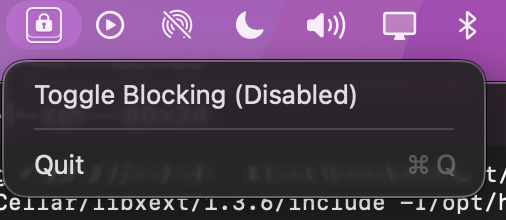

# KeyBlocker

<p align="center">
  
</p>

Another random crap I created because random windows kept popping up while I was cleaning my keyboard. Honestly, I’d rather spend an hour building this tool than deal with that again.

KeyBlocker is a macOS utility that allows you to temporarily disable your keyboard input. This is useful for cleaning your keyboard, preventing accidental keystrokes from pets or children, or simply ensuring no input is registered during certain tasks.

## Features

- **Keyboard Blocking**: Intercepts and blocks all keyboard events.
- **Update Checking**: Checks for updates and notifies the user if a new version is available.
- **Settings**: Configurable settings for keyboard blocking.
- **Custom Panic Shortcut**: Set a custom panic shortcut to quickly toggle keyboard blocking.
- **System Tray Integration**: Easily toggle blocking from the macOS menu bar.
- **Logging**: Configurable logging levels (Info, Error, Debug) for troubleshooting.
- **Ease of Use**: Simple command-line interface and minimalist UI.

## Prerequisites

- **macOS**: This application is specifically designed for macOS using the Core Graphics and Cocoa frameworks.
- **Accessibility Permissions**: The app requires Accessibility permissions to intercept keyboard events. When you first run the app, you will be prompted to allow it in **System Settings > Privacy & Security > Accessibility**.

## Getting Started

### Build

You can build the project using the provided `Makefile`.

```bash
# Build the binary
make

# Create the application bundle (KeyBlocker.app)
make bundle

# Create a distribution DMG
make dmg
```

### Run

You can run the application directly from the binary or open the created bundle.

```bash
# Run the binary
./key_blocker

# With custom log level
./key_blocker --log-level debug
```

### Installing from DMG

1. Download the latest `KeyBlocker.dmg` from the [Releases](https://github.com/malvads/KeyBlocker/releases) page.
2. Open the `.dmg` file.
3. Drag `KeyBlocker.app` into your `/Applications` folder.
4. Launch the app and grant the required **Accessibility Permissions** when prompted.
5. Relaunch the app (if permissions were granted)


## Usage



Once running, you will see a tray icon in your menu bar. 
- Click the icon to display KeyBlocker's window.
- Click the switch to toggle keyboard blocking on or off.
- Click "Enable Shortcut" to enable the custom panic shortcuts.
- Click "Unlock Shortcut" to write your own custom panic shortcut command (Needs Enable Shortcut to be enabled).

### Command Line Arguments

- `-v`, `--verbose`: Enable debug logging.
- `--log-level <level>`: Set the log level. Available levels: `debug`, `info`, `error`.

## License

This project is licensed under the Affero General Public License v3.0 - see the [LICENSE](LICENSE) file for details (if applicable).

## Author

Miguel Álvarez 